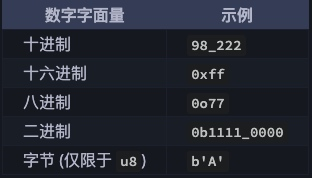

# 九层之台，起于累土 —— Rust语言基础

>
> 合抱之木，生于毫末；九层之台，起于累土；千里之行，始于足下。
> 
>  ——《道德经》第六十四章
> 

本文介绍Rust语言的基础内容，也是任务一门计算机语言中的通用的部分。其旨在让你快速上手Rust的编程，主要包括的内容有：`变量`、`数据类型`、`函数`、`程序控制流`等。学完这些内容后，应能掌握`面向过程式（OOP）`编程，能较熟练地编写出用于解决诸如`查找与排序`等数据结构与算法相关的问题。

## 1. 变量与常量
### 1-1. 变量
几乎在我们所接触的所有语言中都存在`变量`这个概念，在Rust中的变量，基本上等同于其他语言中的定义。`变量`可以理解为一个名字，这个名字代表着内存中的某一块内存。内存中的内容当然会变化，这也是`变`字所表达的最明显含义。当然，对于用于这个`名字`的标识符范围也是有规则约束的，其规则遵同其他语言的通用规则，比如:`不能用数字开头`、`不能使用诸如if之类的语言保留字`等等。

闲话少说，让我们直奔主题吧！

#### 定义变量
```Rust
let some_name: data_type = some_value;
```
上面示例代码，是一个完整的变量定义语句。它表示定义了一个名为`some_type`的变量，它的类型为`data_type`，其对应的值为`some_value`。
Rust 的编译器很智能，大部分情况下，可以省略`data_type`，其类型可以由右边的值自动推断出正确的类型。

这就完了，发现与其他语言没有什么区别。但 Rust 还有点不一样，接下来我们来说说它的不同之处吧。
* 变量定义在Rust中有一个专门的叫法：`变量绑定`。
* 所有的变量默认是不可变的（这也可能是`绑定`的原因吧）。
* 要想让变量绑定的值能改变，在定义的时候，必须在变量名的前面显式地标注 `mut`关键字。

看一段代码：
```Rust
fn main() {
    let x = 5;
    println!("The value of x is: {}", x);
    x = 6;
    println!("The value of x is: {}", x);
}

```
运行上面的程序，会得到类似如下的编译错误：
```shell
2 |     let x = 5;
  |         -
  |         |
  |         first assignment to `x`
  |         help: consider making this binding mutable: `mut x`
3 |     println!("The value of x is: {}", x);
4 |     x = 6;
  |     ^^^^^ cannot assign twice to immutable variable

For more information about this error, try `rustc --explain E0384`.
error: could not compile `variables` due to previous error
```
上面的错误指出错误的原因是 cannot assign twice to immutable variable `x`（不能对不可变变量二次赋值），因为我们尝试给不可变的 x 变量赋值为第二个值。

我们只需在上面的变量`x`前面加上`mut`关键字，程序就可以正常通过编译并输出预期的结果。
```Rust
let mut x = 5;
```

#### 变量的遮蔽
意思就是，第一个变量可以被第二个同名的变量所遮蔽（shadow），这意味着当我们使用变量时我们看到的会是第二个变量的值。变量遮蔽后，原先的那个被遮蔽的变量失效（对于后续的代码不可见）。我们可以通过使用相同的变量名并重复使用 let 关键字来遮蔽变量，如下所示：
```Rust
fn main() {
    let x = 5;

    let x = x + 1;

    {
        let x = x * 2;
        println!("The value of x in the inner scope is: {}", x);
    }

    println!("The value of x is: {}", x);
}

```

需要注意的是，`新变量`与`被遮蔽的变量`之间的关系，仅仅是名字在字面上一样，仅此而已！这就意味着，新变量可以有完全不同的类型，比如：
```Rust
let x = 5; //x 的类型由编译器自动推导为 `i32`
let x = "new value"; // x 的类型由编译器自动推导为 `&str`
```


### 1-2. 常量
常量（constant）是绑定到一个常量名且不允许更改的值。但在 Rust 中，变量默认也是不可变的，那为什么还需要引入`常量`的概念呢？两者间的差别有：
* 常量不允许使用 mut。
* 常量在定义（绑定）的时候，必须要显式初始化值，没有默认值。
* 常量在定义（绑定）的时候，必须要显式地指定数据类型，编译器不会进行类型推导。
* 常量可以在任意作用域内声明，包括全局作用域。
* 常量只能设置为常量表达式，而不能是函数调用的结果或是只能在运行时计算得到的值。

下面是一个定义常量的示例代码：
```Rust
const DAY_IN_WEEK: u8 = 7; // Rust 常量的命名约定是全部字母都使用大写，并使用下划线分隔单词。
```


## 2. 数据类型的本质

运行程序所需要的数据，一般存储在内存中。内存元器件中的`高电平`与`低电平`的物理状态，被解读为`0`和`1`的`位（bit）`，8个`位（bit）`为一个`字节（byte）`。这里的`位`、`字节`都是一种数据类型。但仅仅用`位`与`字节`这种原始的类型，不足以（不便于）刻画我们的业务，于是就出现了诸如表示数字的`整型`、表示一连串字符的`字符串` 等等用于特定场景的有点业务味道的类型。不过，这种类型，通常是在机器架构层面提供的。作为一种语言的编译器层面，也当然会有对应之物。当然，进一步，语言层面，往往会提供更多的类型，以满足使该语言对业务建模的需求，比如，`结构体`、`枚举`、`类`等等。

每一个数据类型，都规定了该类型所占用的长度，比如在32位系统中，整型通常用占用4个字节（32位），布尔类型占用1个字节（8位）。即使整数`1`只需要一个位来表示，也要占用32位。

数据类型是对数据的抽象，不同的类型，其抽象的粒度不一样。数据类型，为CPU解读内存数据提供了共识。当CPU通过变量（内存地址的别名）去访问内存时，可以根据类型信息，知道把从内存位置开始到什么地方结束的这一块内存内容当成一个整体去解读。这个，对指针类型尤为明显，比如指针类型的`解指针`和`作自增`操作。

内存中原本只是`0101...`这种毫无意义的物件，这是一个混沌的世界。"神说要有光，于是就有了光"！这个神，肯定是我们道家中的神仙，他“道法自然”，点化万物，`0101...`立马变成了各种生机勃勃的精灵，有红楼里轮回三生三世的绛珠仙草，有九龙潭的鳌、羚、鹰、鱼、虾、蛇，有沧海畔那“蝉眼龟形脚似蛛，未曾正面向人趋”的螃蠏侠，有... 于是就有了五色缤纷的世界，当然也有了险恶的江湖。对不起，扯远了。


## 3. 基本类型
### 3-1. 整数类型
整数是没有小数部分的数字， `i32` 类型，表示有符号的 32 位整数（ i 是英文单词 integer 的首字母，与之相反的是 u，代表无符号 unsigned 类型）。下表显示了 Rust 中的内置的整数类型：


类型定义的形式统一为：有无符号 + 类型大小(位数)。无符号数表示数字只能取`正数`和`0`，而有符号则表示数字可以取`正数`、`负数`还有`0`。就像在纸上写数字一样：当要强调符号时，数字前面可以带上正号或负号；然而，当很明显确定数字为正数时，就不需要加上正号了。有符号数字以补码形式存储。

每个有符号类型规定的数字范围是 `-(2^n - 1) ~ 2^n - 1 - 1`，其中 `n` 是该定义形式的位长度。因此 `i8` 可存储数字范围是 `-(2^7) ~ 2^7 - 1`，即 `-128 ~ 127`。无符号类型可以存储的数字范围是 `0 ~ 2^n - 1`，所以 `u8` 能够存储的数字为 `0 ~ 2^8 - 1` ，即 `0 ~ 255`。

此外，`isize` 和 `usize` 类型取决于程序运行的计算机 CPU 类型： 若 CPU 是 32 位的，则这两个类型是 32 位的，同理，若 CPU 是 64 位，那么它们则是 64 位。

整形字面量可以用下表的形式书写：



这么多类型，有没有一个简单的使用准则？答案是肯定的， Rust 整型默认使用 i32，例如 `let i = 1`，那 i 就是 i32 类型，因此你可以首选它，同时该类型也往往是性能最好的。`isize` 和 `usize` 的主要应用场景是用作集合的索引。

### 3-2. 浮点数类型
浮点数（floating-point number）是带有小数点的数字，在 Rust 中浮点类型（简称浮点型）数字也有两种基本类型。Rust 的浮点型是 f32 和 f64，它们的大小分别为 32 位和 64 位。默认浮点类型是 f64，因为在现代的 CPU 中它的速度与 f32 的几乎相同，但精度更高。所有浮点型都是有符号的。
下面是一个演示浮点数的示例：

```Rust
fn main() {
    let x = 2.0; // 默认类型为： f64

    let y: f32 = 3.0; // f32
}
```

浮点数按照 IEEE-754 标准表示。f32 类型是单精度浮点型，f64 为双精度浮点型。

Rust 的所有数字类型都支持基本数学运算：加法、减法、乘法、除法和取模运算。整数除法会向下取整。下面代码演示了各使用一条 let 语句来说明相应数字运算的用法：
```Rust
fn main() {
    // addition
    let sum = 5 + 10;

    // subtraction
    let difference = 95.5 - 4.3;

    // multiplication
    let product = 4 * 30;

    // division
    let quotient = 56.7 / 32.2;
    let floored = 2 / 3; // Results in 0

    // remainder
    let remainder = 43 % 5;
}

```

### 3-3. 字符类型
直接看代码：
```Rust
let c = 'z';
let z = 'ℤ';
let heart_eyed_cat = '😻';
```
有几点需要注意：
* 声明的 `char` 字面量采用单引号括起来，这与字符串字面量不同，字符串字面量是用双引号括起来。
* Rust 的字符类型大小为 4 个字节，表示的是一个 `Unicode` 标量值，这意味着它可以表示的远远不止是 `ASCII`。标音字母，中文/日文/韩文的文字，emoji，还有零宽空格(zero width space)在 Rust 中都是合法的字符类型。

### 3-4. 布尔类型
Rust 中的布尔类型有两个可能的值：true 和 false，布尔值占用内存的大小为 1 个字节：
```Rust
fn main() {
    let t = true;

    let f: bool = false; // 使用类型标注,显式指定f的类型

    if f {
        println!("这是段毫无意义的代码");
    }
}
```
使用布尔类型的场景主要在于流程控制，例如上述代码的中的 if 就是其中之一。


## 4. 复合类型
复合类型（compound type）可以将多个值组合成一个类型。Rust 有两种基本的复合类型：`元组（tuple）` 和 `数组（array）`。
### 4-1. 元组
元组是将多种类型的多个值组合到一个复合类型中的一种基本方式。元组的长度是固定的：声明后，它们就无法增长或缩小。

我们通过在小括号内写入以逗号分隔的值列表来创建一个元组。元组中的每个位置都有一个类型，并且元组中不同值的类型不要求是相同的。
```Rust
let tup: (i32, f64, u8) = (500, 6.4, 1); // 定义元组的示例代码
```
可以通过下标索引访问：
```Rust
println!("1st number is {}", tup.0); // 0表示第一个元素，1表示第二个元素...
```

可以解构：
```Rust
let tup = (500, 6.4, 1);
let (x, y, z) = tup;
println!("The value of y is: {}", y);
```

没有任何值的元组是一种特殊的类型，只有一个值，也写成 `()`。该类型被称为单元类型（unit type），该值被称为单元值（unit value）。如果表达式不返回任何其他值，就隐式地返回单元值。
```Rust
    // 单元类型 （）
    // 单元类型在Rust中是非常重要的类型，如果表达式不返回任何其他值，就隐式地返回单元值，
    // 如没有返回值的函数或者作用域

    let a: () = {};
    fn return_tuple() {}
    let func: () = return_tuple();
    assert_eq!(a, func);
```

### 4.2 数组
数组的具体定义很简单：将多个类型相同的元素依次组合在一起，就是一个数组。数组的三要素：
* 长度固定，一经定义就不可以改变
* 元素必须有相同的类型
* 依次线性排列

一个简单的示例：
```Rust
// 通过索引来访问或者修改数组中的元素
let arr = [1, 2, 3, 4, 5]; // 编译器自动推导arr的类型为[i32;5] 数组
let mut arr1 = [0, 0, 0, 0, 0];
arr1[0] = 100;
println!("{:?}", arr1); // [100, 0, 0, 0, 0]
```

数组的正式类型： [元素的类型; 数组元素的总长度]，比如：
```Rust
let a: [i32; 5] = [1, 2, 3, 4, 5]; 
```

可以使用下面的语法初始化一个某个值重复出现 N 次的数组：
```Rust
let a = [3; 5]; // a 数组包含 5 个元素，这些元素的初始化值为 3
```

访问数组时，索引的范围：[0, 数组长度N)，即从0开始到长度N-1 。如果越界访问，会导致 Rust 运行时错误。

至此，数组就介绍完了，最后有两个注意的点：
* 数组是存储在栈上
* 数组的长度也是类型的一部分，[u8; 3]和[u8; 4]是不同的类型。

## 5. 函数
函数其实也是一种数据类型，函数名称跟其他的变量名一样会关联到内存中代码区的某一个地方，代码将从这个地方开始执行代码。函数除了有名称，还有对应的具体类型，即函数签名，用来描述`调用函数需要需要传入的数据，即参数` 及 `函数运行结束后返回的数据类型` 等信息。

Rust 函数签名如下：

`fn func_name1(param1: type1, parm2: type2,...) -> return_type` //完整函数的签名

`fn func_name2() -> return_type` // 无参数函数的签名

`fn func_name3(param: type1)` // 无返回值函数的签名，默认返回值的类型为()

`fn func_name4()` // 无参数且无返回值函数的签名

在函数签名后面 加上一对大括号，写在这对括号内的代码叫做函数体。总体来说，Rust函数与其他C系语言（比如C/C++/Java等）是类似的。上一段代码：
```Rust
    // 1 函数定义
    // 1.1 没有参数和返回值的函数
    fn foo() {
        println!("foo")
    }

    // 1.2 有参数和返回值的函数

    fn bar(s: &str) -> String {
        String::from(s)
    }

    // 1.3 参数类型必须显式声明，比如引用或者可变性

    fn foobar(mut s: &str) -> &str {
        s = "rust";
        s
    }

    // 2 函数调用

    foo();
    bar("Rust");
    foobar("go");

    // 3 函数作为参数

    fn a(f: fn() -> u32) -> u32 {
        let value = f();

        value
    }

    fn b() -> u32 {
        42
    }

    // 把函数作为参传给另一个函数

    a(b);
```

有一个比较特殊的地方需要注意一下，就是函数返回值如果是`表达式`，可以不用显式的加上`return`关键字，代码末尾也不用加上`;`号，比如上面的函数`b()`中返库的`42`。这种便捷技巧，请一定要掌握！在Rust中实践中应用得相当广泛。
Rust把有`语句`与`表达式`之分，两者的区别，请记住一句话：“语句用来指示干什么工作，本身不返回值；否则就是表达式“。比如 `let apple = 5` 就是指示做绑定操作，并没有返回值，所以它是语句；`42+1`、`88`，没有指示干什么操作，都是表达式。

最后一点，就是如果函数没有显式返回，其返回的类型是`()`，类似于C语言中的`void`，表示什么都没有。

## 6. 程序控制流
### 6-1. if 表达式
if 表达式允许根据条件执行不同的代码分支，跟其他语言没有什么区别。
看一段代码：
```Rust
fn main() {
    let number = 6;

    if number % 4 == 0 {
        println!("number is divisible by 4");
    } else if number % 3 == 0 {
        println!("number is divisible by 3");
    } else if number % 2 == 0 {
        println!("number is divisible by 2");
    } else {
        println!("number is not divisible by 4, 3, or 2");
    }
}
```
条件必须为bool类型，这点与 C 语言是不一样的。

#### 在let语句中使用if
因为 if 是一个表达式，我们可以在 let 语句的右侧使用它来将结果赋值给一个变量，如下代码：
```Rust
fn main() {
    let condition = true;
    let number = if condition { 5 } else { 6 };

    println!("The value of number is: {}", number);
}
```
number 变量将会绑定到表示 if 表达式结果的值上。

### 6-2. loop 循环
`loop`用来实现一个无限循环，可以使用 break 语句在任何时候退出一个循环，还可以使用 continue 跳过循环体的剩余部分并开始下一轮循环。如下面代码：
```Rust
fn main() {
    let mut count = 0u32;

    println!("Let's count until infinity!");

    // 无限循环
    loop {
        count += 1;

        if count == 3 {
            println!("three");

            // 跳过这次迭代的剩下内容
            continue;
        }

        println!("{}", count);

        if count == 5 {
            println!("OK, that's enough");

            // 退出循环
            break;
        }
    }
}

```

#### 嵌套循环和标签
在处理嵌套循环的时候可以 break 或 continue 外层循环。在这类情形中，循环必须用一些 'label（标签）来注明，并且标签必须传递给 break/continue 语句。
```Rust
#![allow(unreachable_code)]

fn main() {
    'outer: loop {
        println!("Entered the outer loop");

        'inner: loop {
            println!("Entered the inner loop");

            // 这只是中断内部的循环
            //break;

            // 这会中断外层循环
            break 'outer;
        }

        println!("This point will never be reached");
    }

    println!("Exited the outer loop");
}

```

#### 从loop 循环中返回
可以从`loop`中返回值：将该值放在 break 之后，它就会被 loop 表达式返回。
```Rust
fn main() {
    let mut counter = 0;

    let result = loop {
        counter += 1;

        if counter == 10 {
            break counter * 2;
        }
    };

    assert_eq!(result, 20);
}
```

### 6-3. while 循环
while 关键字可以用作当型循环（当条件满足时循环）。
```Rust
fn main() {
    let mut x = 0; // 计数器变量
    while x < 5 {
        println!("x is {}", x);
        x += 1;
    }
}
```

### 6-4. for 循环
`for` 循环是 Rust 的大杀器，相比其他的两种，在`性能`与`安全`方面都具有优势。`for`事实上只是迭代器的一种语法糖，在这里不便于全面介绍清楚，在后面讨论迭代器的时修改再做详尽介绍。在此，仅跟出几种常用的范例。
#### 使用 for 遍历区间
for in 结构可以遍历一个 Iterator（迭代器）。创建迭代器的一个最简单的方法是使用区间标记 `a..b`。这会生成从 `a`（包含此值） 到 `b`（不含此值）的，步长为 `1` 的一系列值。
```Rust
fn main() {
    for i in 1..6 {
        println!("{}", i);
    }
}
```
以上代码循环输出一个从 1 到 5 的序列。或者，可以使用 `a..=b` 表示两端都包含在内的范围。上面的代码可以写成：
```Rust
fn main() {
    for i in 1..=5 {
        println!("{}", i);
    }
}
```
#### 使用for遍历集合
用for遍历集合，其实质是遍历一个 Iterator（迭代器），运行时执行的是迭代器的相关方法。细节后面讨论迭代器时再说。

```Rust
fn main() {
    let a = [10, 20, 30, 40, 50];
    for element in a {
        println!("the value is: {}", element);
    }
}
```

### 6.5 while vs for
看两段完成同样功能代码：

#### while实现的：
```Rust
fn main() {
    let a = [10, 20, 30, 40, 50];
    let mut index = 0;

    while index < 5 {
        println!("the value is: {}", a[index]);

        index = index + 1;
    }
}
```
代码对数组中的元素进行计数。它从索引 0 开始，并接着循环直到遇到数组的最后一个索引（这时，`index < 5` 不再为真）。这种通过索引访问元素的方式，由于越界会panic，所以每一次循环都会检查`index`的值，这就影响了性能。

#### for 实现的：
```Rust
fn main() {
    let a = [10, 20, 30, 40, 50];

    for element in a.iter() {
        println!("the value is: {}", element);
    }
}
```

可以看出，`for` 并不会使用索引去访问数组，因此更安全也更简洁，同时避免 运行时的边界检查，性能更高。

## 总结
本文就语言的通用部分作了较系统的介绍，一些与Rust固有特色相关的概念未作深入探究。阅读完本文，读者应该掌握了Rust中的“十八般兵器”的基本使用。