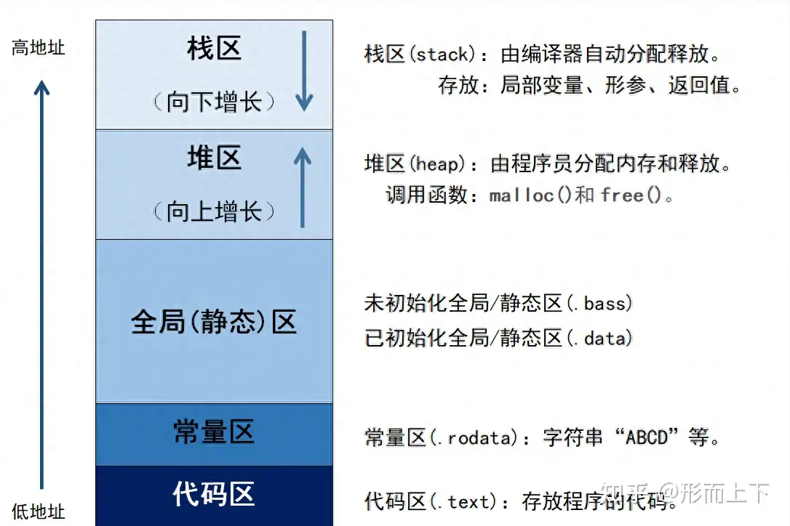

# 欲知山中事，须问打柴人 —— 程序与内存的哪点事儿

> 近水识鱼性，近山识鸟音。
> 欲知山中事，须问打柴人。
> —— 《增广贤文》
>

所有权，是Rust中的一个重要语言特性，也是其他特性的基石。能否理解所有权的内涵，直接影响Rust 后续学习的进展。所有权涉及诸如内存管理等其他相关概念，了解这些相关的概念，将有利于加深对所有权概念的理解。所以有必要就相关内容作一个科普性介绍，于是就有了该文。

当然，这些属于《操作系统》中的知识，本文只是做一个简要的介绍，可能有不准确甚至错误之处，但应该不影响我们的目的 —— 掌握所有权 ！

## 1. 程序的生死轮回

### 1-1. 生成可执行程序

用计算机程序语言编写的源代码，通过编译器的编译、汇编、链接，生成某个特定目标机器上的可执行程序。这个可执行程序里，存放的都是“二进制”的内容，人类无法识别，专供CPU阅读。不同的目标系统上的可执行程序的格式也不一样，比如`Windows`下是`PE`格式，`Mac Os` 下是`Mach O`格式，`Linux`下是`ELF`格式，等等。
这一步，就是无中生有。在物理层面，实实在在地生成了一个文件，只是它还没有生命。

### 1-2. 加载到内存

当用户运行一个程序时（比如点击桌面上的`WeiChat`图标），会呼叫操作系统中一个叫做`加载器`的神仙，他会把欲执行程序进行乾坤大挪移，即按照一定的规则把它搬送到内存中合适的位置。这还不够，还需做一系列的准备工作，比如加载程序所依赖的动态库等等。然后会把控制权移交给被加载的程序。这个时候，程序变变身成进程，程序就有了生命。

### 1-3. 开始运行

被加载程序接管控制权后，会从`main`开始执行代码，我们的程序就正式开始运行了。程序的运行，其实就是`CPU`反复地读写内存的过程。CPU根据`指令寄存器`的内容，从内存中的`代码段`中读取具体的指令，然后执行指令，在指令的执行过程中会对内存进行各种读写操作。就这样周而复始、生生不息，直到程序运行完毕或者用户显式关闭。当然，运行过程中遇到了异常也会被强行中断。

### 1-4. 打个比方

上面的这个过程，我想用厨师做菜的过程来来尝试做进一步的解释，虽然不是太恰当，但愿能有所帮助。

厨房里有一个工作长板，长板上面摆放一些碗，碗里面放有准备好的各种小食材和油盐酱醋等调料等。厨房隔壁有一间很大的储藏间，用来存放各种食材等源材料。假设每一道菜肴都会有两张纸条，一张用以说明制作该菜肴的工艺流程，指导厨师应该怎么做，比如第一步拿什么菜，第二步洗菜，第三步是切菜，等等；别一张，用以说明所需食材的位置，有的就放在厨房的碗中，有的放在储藏间的某层架子上。另外，为厨师配有一个伙计，助手听从厨师的使唤，在储藏间与厨房之间跑腿。

炒菜时，厨师先会拿到该道菜的两条纸条，按照纸条上的流程一步一步的操作。需要食材时，按照纸条去找。如果食材放在厨房内部的，他自己去拿，如果是放在储藏间，就使唤伙计去跑脚。

这里的厨师就CPU，厨房长板上的碗就是内存中的栈，储藏间就是内存中的堆。纸条本身就是可执行程序，当厨师拿到纸条的时候，就代表程序运行起来了。

## 2. 内存管理

程序加载到内存后，操作系统会为其创建一个对应的进程，并以进程为单位在内存中分配了独立的进程空间。这是一个封闭的空间，该程序中的指令无法访问进程空间外的其他内存空间。进程空间大致分为`代码区`、`常量区`、`全局静态区`、`栈区`、`堆区`。

### 2-1. 内存的分区



#### 代码区

主要存放程序的可执行指令、函数符号表等信息，CPU根据这些指令及符号表进行相应的操作。

#### 栈区

程序运行的实际“练兵场”，里面存放局部变量、形参、返回值等。

#### 堆区

是供程序在运行过程按需要使用的区域，在需要时申请，不需要时释放。申请堆内存，是指CPU根据代码区中的分配指令（`malloc`对应的机器指令)，在运行的时候进行的；释放堆内存，是根据释放指令(`free`对应的机器指令)，也是在运行的时候进行的。

#### 其他的区

这些区的叫法可能不太一样，主要用来存放`只读`的数据，比如常量字符串、全局或静态变量等内容。这些内容，通常是在编译的时候就写死在可执行程序文件里面的。

程序加载到内存时，操作系统会为进程分配一个栈空间和一个堆空间。栈主要是用来运行函数，堆用来保存运行时按需求分配的内容。栈与堆的大小都是有限的，这也就是调用一个没有返回条件的递归函数时，会导致耗尽栈空间，而被操作系统终止的原因。

这两个空间，一开始可以认为是空白无瑕的，里面几乎没有数据。CPU从 `代码区` 中读取指令，若是遇到与内存操作相关的指令，要么对栈、要么对堆，做各种读写操作，比如分配内存或修其中的内容，经过这种一系列的操作后，这两个空间中的内容就会各有千秋。

### 2.2 栈与函数调用

可以把这个第一次分配的栈看作是整个程序的最外层栈，`main`函数就在这个栈空间中运行的，函数中声明的基本类型的变量，会存放在这个栈空间里。每一个函数被运行时，都会分配一个专门的函数栈，为了管理这些栈，有两个寄存器（栈底寄存器、栈顶寄存器）分别指向栈的底部和顶部。

比如：

```Rust
fn main() {
    let a: i32 = 88;
    let b: i32 = 12;
}
```

CPU 会在栈空间中分配一个4个字节(`i32`)空间，将其赋值为`88`，然后再分配4个字节(`i32`)的空间，将其赋值为`12`。
每进行一次栈空间的分配，都会同时修改栈顶寄存器（`SP`）的内容，让栈顶指针始终指向栈顶，上面代码执行完后时，`SP`指向`b`所代表的内容。

当我们在一个函数内部，调用另一个函数时，会开辟一个新的栈空间以供这个被调用程序使用，这就是所谓的函数调用栈。

比如：

```Rust
fn add(a: i32, b: i32) -> i32 {
{
    a + b
}

fn main() {
    let a: i32 = 88;
    let b: i32 = 12;
    
    let c = add(a,b);
    println!("a + b = {}", c);
}
```

当调用 `add`函数时，首先会保存调用方的（比如`main`函数对应的栈等）现场信息，然后在当前栈顶push一个新的栈。在新的栈空间里，会分配相应的空间用于放置参数对应的内容，接着调用加法指令完成加法操作，接着把结果返回到调用方。返回的过程，其实就是把当前函数(`add`函数)栈pop出去，再恢复现场信息，比如让栈底/栈顶寄存器分别指向原调用函数(`main`)的函数栈。

可见，对于栈空间的分配与释放过程，是由栈底与栈顶寄存器中的内容决定的，它是一个自动的过程。程序是无法显式更改其流程的。栈空间的分配与释放无非是两个寄存器内容的改变而已。所以，**我们不用关心栈空间的分配与释放问题！**

### 2-3. 指针类型

指针类型的变量，跟其他变量一样，本身都是内存中的一个位置，CPU也是通过变量的名称找到这个位置。但是，这个位置对应的空间上存放的内容是描述另一个内存空间的位置信息，即内存的地址。

之所以要专门介绍指针类型，是因为它是程序与堆内存交互的媒介，**程序总是通过先访问保存在栈上指针，然后根据指针中存放的地址再去访问堆上空间。**

当然，指针类型的变量本身，既可以放在栈上，也可以放在堆上；指针类型变量中存放的值，既可以是栈上的内存地址，也可以是堆上的内存地址。只是大多数情况，指针变量本身存放在栈上，其存放的内容是堆上的空间地址。

### 2-4. 堆空间

堆空间是程序在运行的时候按需使用到的那一部分内存，相当于“炒菜”中的那个大房间。当CPU读取到向堆分配内存的指令时，就会动态地分配一块堆内存空间。为了使用这一块分配的堆内存，需要记住这块堆内存的起始地址，所以，在分配完堆内存的同时，会返回它的起始地址，这个起始地址会用一个变量保存起来以备后用。这个变量就是一个经典的指针，通常是保存在栈空间中的。

可见，**要访问堆上的内容，要通过栈上指针类型的变量进行中转。CPU对内存的视角，从这个意义上讲，只限制在栈内，栈才是程序运行的主戏台，堆顶多只是一个幕后者。**

与栈不同的是，堆空间的管理是离散的，分配堆内存前，无法预知其具体的地址。由于缺少栈空间管理自动性，所以必须的记住分配的堆内存地址，用以在不需要使用时，显式地释放堆内存。

**如果对堆上分配的内存空间管理不善，就会出现如下3个主要问题：**

* 忘记释放不再需要使用的堆空间，导致内存泄露问题；
* 当多个指针变量指向同一个堆地址空间时，通过其中一个指针变量释放后，再通过其他指针变量使用，会导致悬垂指针（野指针）问题；
* 当多个指针变量指向同一个堆地址空间时，通过多个指针变量重复释放问题。

### 2-5. 要解决的问题

内存管理的核心是对堆内存的管理，其要解决的核心问题就是，堆内存可能出现的上述3个问题，即`内存泄露`、`悬垂指针`、`重复释放`。寻求对这三个问题的解决方案，是作为一门编程语言的第一要务。业界已有两种主流的解决方案，一种是`手动管理方式`(比如`C/C++`)，另一种是`垃圾回收管理方式`(Golang/Java)。不过，现在出现了第三种方案，那就是 Rust 提出的`所有权机制`。

## 3.总结

本文就一个程序从源代码到运行的整个过程进行了系统地介绍，重点讨论了内存中栈与堆在程序运行中各自充当的角色以及两者的区别。栈才是程序运行的主戏台，要访问堆上的内容，要通过栈上指针类型的变量进行中转。栈内存的管理是自动的，堆是内存管理的重点与难点。要做好内存管理，其实质就是要解决可能出现的`内存泄露`、`悬垂指针`、`重复释放`等问题。继`手动管理`、`垃圾回收`的内存管理方式后，Rust中创造性地提出了`所有权`机制。
