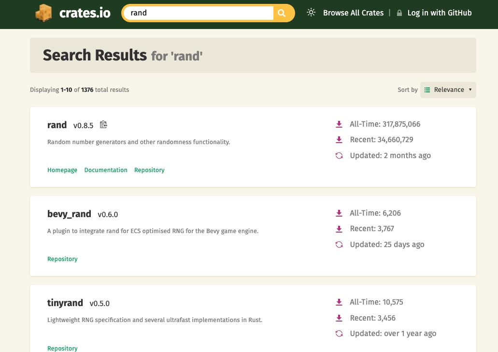
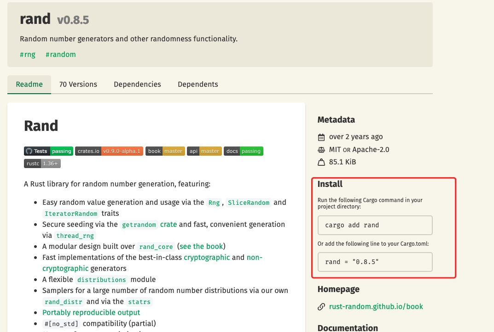

# 与君初相识，犹如故人归 —— 初识Rust
>
> 与君初相识，犹如故人归。
> 天涯明月新，朝暮最相思。
> —— 杜牧《会友》

*友情申明：本文项目中的内容直接来自于《The Rust Programming Language》中第1章与第2章（部分内容由AI翻译），可能冗长乏味，建议慎重阅读。若有未详尽或不准确之处，请直接阅读原书之内容。*

在上一章里，介绍了Rust的一些基本情况，也搭建好了Rust的开发环境，但只是“空山不见人，但闻人语响”。现在，是时候约Rust出来见一面了！本文会手把手带你编写三个小项目，并对其中的代码进行细致地解读。有些内容不求你甚解，权当与Rust打个照面、混个面熟，也算是与Rust相识了。

“与君初相识，犹如故人归”，自然甚好；要是 “我断不思量，你莫思量我”，请不要原谅我！

那就开始吧！

## Hello,World

作为程序界的惯例，我们选择从这个经典的程序开始，算是与Rust打一个招呼吧。

### 1. 创建项目目录

对 Rust 来说，你的代码在哪里并不重要，但还是建议为Rust类型项目专门创建一个目录。我们建议在你的主目录中创建一个项目目录并将所有项目保存在那里。

打开终端并输入以下命令以创建项目目录和“Hello, world!”目录 项目目录中的项目。

对于 Windows 上的 Linux、macOS 和 PowerShell，请输入：

```shell
mkdir ~/projects
$ cd ~/projects
$ mkdir hello_world
$ cd hello_world
```

对于 Windows CMD，输入：
```shell
> mkdir "%USERPROFILE%\projects"
> cd /d "%USERPROFILE%\projects"
> mkdir hello_world
> cd hello_world
```

### 2.编写和运行 Rust 程序
接下来，创建一个新的源文件并将其命名为main.rs。Rust 文件总是以.rs扩展名结尾。如果您在文件名中使用多个单词，请使用下划线分隔它们。例如，使用hello_world.rs而不是 helloworld.rs。

现在打开您刚刚创建的main.rs文件并输入如下代码：

文件名：main.rs

```Rust
fn main() {
    println!("Hello, world!");
}
```

保存文件并返回终端窗口。在 Linux 或 macOS 上，输入以下命令来编译和运行文件：
```shell
$ rustc main.rs
$ ./main
Hello, world!
```
在 Windows 上，输入命​​令.\main.exe而不是./main：
```shell
> rustc main.rs
> .\main.exe
Hello, world!
```
无论您的操作系统是什么，字符串Hello, world!都应该打印到终端。如果您没有看到此输出，请参阅 安装部分的“疑难解答”部分以获得帮助。

如果Hello, world!打印出来了，恭喜！你已经正式编写了一个 Rust 程序。这让你成为 Rust 程序员——欢迎！

### 3. Rust 程序剖析
让我们详细回顾一下刚刚在您的“Hello, world!”中发生的事情。程序。这是拼图的第一部分：
```Rust
fn main() {
}
```
这些行在 Rust 中定义了一个函数。这个main函数很特别：它总是在每个可执行的 Rust 程序中运行的第一个代码。第一行声明了一个名为的函数main，它没有参数并且不返回任何内容。如果有参数，它们将放在`()`内。

另外，请注意，函数体用`{}`括起来， 将`左大括号`与`函数声明`放在同一行是一种很好的风格，在两者之间添加一个`空格`。

如果你想在 Rust 项目中坚持标准风格，你可以使用一个名为的自动格式化工具`rustfmt`来格式化你的代码为特定风格。

main函数内部是以下代码：
```Rust
println!("Hello, world!");
```

这一行完成了这个小程序中的所有工作：它将文本打印到屏幕上。这里有四个重要的细节需要注意。

首先，Rust 风格是缩进四个空格，而不是制表符。

其次，`println!` 是 Rust `宏`。如果它改为调用一个函数，它将被输入为`println`（不带!）。

第三，你看到了`"Hello, world!"`字符串。我们将此字符串作为参数传递给`println!`，然后将字符串打印到屏幕上。

第四，我们用分号 ( ;) 结束这一行，这表示这个表达式已经结束，下一个表达式已准备好开始。大多数 Rust 代码行都以分号结尾。

### 4. 编译和运行是分开的步骤
您刚刚运行了一个新创建的程序，因此让我们检查该过程中的每个步骤。

在运行 Rust 程序之前，您必须使用 Rust 编译器通过输入`rustc`命令并将源文件的名称传递给它来编译它，如下所示：
```shell
$ rustc main.rs
```
如果您有 C 或 C++ 背景，您会注意到这类似于gcc 或者 clang。编译成功后，Rust 会输出一个二进制可执行文件。

在 Linux、macOS 和 Windows 上的 PowerShell 上，您可以通过ls在 shell 中输入命令来查看可执行文件。在 Linux 和 macOS 上，您将看到两个文件。使用 Windows 上的 PowerShell，您将看到与使用 CMD 相同的三个文件。
```shell
$ ls
main  main.rs
```
在 Windows 上使用 CMD，您将输入以下内容：
```shell
> dir /B %= the /B option says to only show the file names =%
main.exe
main.pdb
main.rs
```

这显示了带有.rs扩展名的源代码文件、可执行文件（在 Windows 上为main.exe，但在所有其他平台上为main），以及在使用 Windows 时，包含带有.pdb扩展名的调试信息的文件。从这里，您运行main或main.exe文件，如下所示：
```shell
$ ./main # or .\main.exe on Windows
```

执行上面的命令，此行将打印`Hello, world!`到您的终端。

如果您更熟悉动态语言，例如 Ruby、Python 或 JavaScript，您可能不习惯将程序作为单独的步骤进行编译和运行。Rust 是一种提前编译的语言，这意味着您可以编译程序并将可执行文件提供给其他人，即使没有安装 Rust，他们也可以运行它。如果您给某人一个.rb、.py或 .js文件，他们需要（分别）安装一个 Ruby、Python 或 JavaScript 实现。但是在那些语言中，您只需要一个命令来编译和运行您的程序。一切都是语言设计的权衡。

对于简单的程序来说，只用`rustc`编译就可以了，但是随着项目的增长，您将需要管理所有选项并轻松共享您的代码。接下来，我们将向您介绍 Cargo 工具，它将帮助您编写真实的 Rust 程序。

## Hello,Cargo!
Cargo 是 Rust 的构建系统和包管理器。大多数 Rustaceans 使用这个工具来管理他们的 Rust 项目，因为 Cargo 会为您处理很多任务，例如构建代码、下载代码所依赖的库以及构建这些库。

最简单的 Rust 程序，就像我们目前所写的一样，没有任何依赖关系。因此，如果我们构建了“Hello, world!” 与 Cargo 合作的项目，它只会使用 Cargo 中处理构建代码的部分。当您编写更复杂的 Rust 程序时，您将添加依赖项，如果您使用 Cargo 启动项目，添加依赖项将更容易做到。

正常情况下，Cargo 会随 Rust 一起安装。如果您通过其他方式安装了 Rust，请通过在终端中输入以下内容来检查是否安装了 Cargo：
```shell
$ cargo --version
```
如果你看到一个版本号，你有它！如果您看到错误，例如command not found，请查看您的安装方法的文档以确定如何单独安装 Cargo。

### 1. 使用Cargo创建项目
让我们使用 Cargo 创建一个新项目，看看它与我们原来的“Hello, world!”有何不同。导航回您的项目目录（或您决定存储代码的任何位置）。然后，在任何操作系统上，运行以下命令：
```shell
$ cargo new hello_cargo
$ cd hello_cargo
```

第一个命令创建了一个名为`hello_cargo`的新目录。由于我们将项目命名为`hello_cargo`，Cargo 在同名目录中创建其文件。

进入`hello_cargo`目录并列出文件。您会看到 Cargo 为我们生成了两个文件和一个目录：一个`Cargo.toml文件`和一个 `src目录`，其中包含一个`main.rs`文件。
```
$ tree -L 2
.
├── Cargo.toml
└── src
    └── main.rs
```

其中`Cargo.toml`的内容，类似如下清单：
```shell
[package]
name = "hello_cargo"
version = "0.1.0"
edition = "2021"

[dependencies]
```
第一行的`[package]`，是一个节标题，指示以下语句正在配置包。随着我们向此文件添加更多信息，我们将添加其他部分。

接下来的三行设置，是 Cargo 编译程序所需的配置信息：名称、版本和要使用的 Rust 版本。

最后一行，`[dependencies]`，是您列出项目的任何依赖项的部分的开始。在 Rust 中，代码包被称为 crates。这个项目我们不需要任何其他 crate，但我们将在下一个“猜数游戏”项目中使用。
现在打开src/main.rs看看：
```Rust
fn main() {
    println!("Hello, world!");
}
```
记得把代码中的"Hello, world!"，改成"Hello, Cargo!" 

到目前为止，我们之前的项目与 Cargo 生成的项目的不同之处在于 Cargo 将代码放在了src 目录中，且在项目根目录中有一个`Cargo.toml`配置文件。

Cargo 希望您的源文件位于src目录中。项目根目录仅用于存放 `README文件、许可证信息、配置文件`以及与您的代码无关的任何其他内容。

如果您启动了一个不使用 Cargo 的项目，就像我们使用“Hello, world!”所做的那样 项目，您可以将其转换为使用 Cargo 的项目。方法是，将项目代码移动到src目录并创建一个适当的Cargo.toml 文件。

### 2. 建立和运行项目
在hello_cargo目录中，通过输入以下命令构建项目：
```shell
$ cargo build
   Compiling hello_cargo v0.1.0 (/Users/mjsong/Desktop/rust_study/hello_cargo)
    Finished `dev` profile [unoptimized + debuginfo] target(s) in 0.68s
```
此命令在`target/debug/hello_cargo`（或 Windows 上的`target\debug\hello_cargo.exe`）而不是在您的当前目录中创建一个可执行文件。
```shell
 $ tree -L 2
.
├── Cargo.lock
├── Cargo.toml
├── src
│   └── main.rs
└── target
    ├── CACHEDIR.TAG
    └── debug
```

您可以使用以下命令运行可执行文件：
```shell
$ ./target/debug/hello_cargo # or .\target\debug\hello_cargo.exe on Windows
Hello, Cargo!
```

Cargo 还会在项目根目录下创建一个`Cargo.lock`文件，该文件跟踪项目中依赖项的确切版本。您永远不需要手动更改此文件，Cargo 为您自动管理其中的内容。

我们刚刚构建了一个项目cargo build并使用 运行它 ./target/debug/hello_cargo，但我们也可以使用它cargo run来编译代码，然后在一个命令中运行生成的可执行文件：
```Rust
$ cargo run
    Finished `dev` profile [unoptimized + debuginfo] target(s) in 0.01s
     Running `target/debug/hello_cargo`
Hello, Cargo!
```

Cargo 还提供了一个名为cargo check. 此命令快速检查您的代码以确保它可以编译但不会生成可执行文件：
```shell
$ cargo check
    Checking hello_cargo v0.1.0 (/Users/mjsong/Desktop/rust_study/hello_cargo)
    Finished `dev` profile [unoptimized + debuginfo] target(s) in 0.09s
```

为什么你不想要一个可执行文件？通常，`cargo check`比`cargo build`快得多，因为它跳过了生成可执行文件的步骤。如果您在编写代码时不断检查您的工作，使用`cargo check`将加快该过程！因此， 定期`cargo check`确保程序可以编译是一个推荐的做法。

让我们回顾一下到目前为止我们对 Cargo 的了解：

* 我们可以使用`cargo build`，编译程序。
* 我们可以使用`cargo run`，编译并运行程序。
* 我们可以使用`cargo check`，在不生成二进制文件的情况下构建一个项目。
* Cargo 没有将构建结果保存在与我们的代码相同的目录中，而是将其存储在`target/debug`目录中。
* 使用 Cargo 的另一个优点是，无论您使用哪种操作系统，命令都是相同的。因此，我们将不再提供针对 Linux 和 macOS 与 Windows 的具体说明。

### 3. 为发布而构建
当您的项目最终准备好发布时，您可以使用 `cargo build --release` 优化来编译它。此命令将在`target/release`而不是`target/debug`中创建可执行文件。优化使您的 Rust 代码运行得更快，但打开它们会延长程序编译所需的时间。这就是为什么有两种不同的配置文件的原因：一个用于开发，当您想要快速且经常重建时，另一个用于构建您将提供给用户的最终程序。如果您要对代码的运行时间进行基准测试，请务必使用 `cargo build --release` 构建项目。

### 4. Cargo作为公约
对于简单的项目，Cargo 并没有提供比`rustc`更多的价值，但是随着你的程序变得更加复杂，它会证明它的价值。对于由多个 crate 组成的复杂项目，让 Cargo 协调构建要容易得多。

尽管这个hello_cargo项目很简单，但它现在使用了很多你将在 Rust 职业生涯中使用的真正工具。事实上，要处理任何现有项目，您可以使用以下命令使用 Git 签出代码，切换到该项目的目录并构建：
```shell
$ git clone example.org/someproject
$ cd someproject
$ cargo build
```

## 猜数游戏
项目的需求：程序将生成一个介于 1 和 100 之间的随机整数。然后它会提示玩家输入猜测。输入猜测值后，程序将指示猜测值是过低还是过高。如果猜对了，游戏将打印祝贺信息并退出。

### 1. 新建项目
我们同样采用Cargo创建与管理项目，执行如下命令：
```shell
$ cargo new guessing_game
$ cd guessing_game
```
项目已经创建好了，其效果跟上一个项目一样，如果编译运行会在终端打印名称“Hello,world!"，我们将在基础上进行迭代，一步步地完成我们的需求。但作为一个习惯，在继续新代码之前，我们要用 `cargo check` 验证一下之前的代码是否有问题。

### 2. 处理猜测
猜谜游戏程序的第一部分将要求用户输入，处理该输入，并检查输入是否符合预期。在`src/main.rs`中输入如下代码 。
```Rust
fn main() {
    use std::io;
    fn main() {
        println!("Guess the number!");
        println!("Please input your guess.");
        let mut guess = String::new();
        io::stdin()
            .read_line(&mut guess)
            .expect("Failed to read line");
        println!("You guessed: {}", guess);
    }
}
```
这段代码包含很多信息，所以让我们逐行查看。要获取用户输入然后将结果打印为输出，我们需要将 `io（输入/输出库）`从标准库（也就是std）引入到项目中。
```Rust
use std::io;
```
作为默认行为，Rust会将预导入模块内的条目自动引入每一段程序的作用域中，它包含了一小部分相当常用的类型。但假如你需要的类型不在预导入模块内，那么我们就必须用use语句来显式地进行导入声明。std::io库包含了许多有用的功能，我们可以使用它来获得用户的输入数据。

`main`函数是程序的入口点：
```Rust
fn main() {}
```
`fn` 表示声明一个新的函数，`main`表示函数的名称（main有特定的含义，表示整个程序的入口程序），`()`里面可以有参数，`{`表示函数体的开始，`}`表示函数体的结束，在`{}`可以写实现函数功能的具体代码。
`println!` 宏可以将字符串打印到屏幕上：

```Rust
println!("Guess the number!");
println!("Please input your guess.");
```
此代码正在打印一个提示，说明游戏是什么并请求用户输入。

### 3. 用变量存储值
接下来，我们将创建一个变量来存储用户输入，如下所示：
```Rust
 let mut guess = String::new();
```
Rust中用`let`来绑定一个变量（在其他语言叫定义或者声明），上面的语句的意思是指，我们把右边的值（字符串对象，现在可以理解为一个空的字符串）绑定到左边的名为`guess`的变量上。
这里有一个值得注意的地方是在 `guess`前面多了一个`mut`，它的意思是，`guess`变量的值在之后还会变化，这也是符合我们需求的，因为它将用来保存用户的输入。在Rust世界中，所有的变量在绑定（定义）之后，是不能改变的，除非绑定（定义）的时候在名称前面显式地标 `mut` 。
看一下下面的代码：
```Rust
let apples = 5; //不能改变
//apples = 8; //此处会导致编译错误
let mut oranges = 5;
oranges = 8; // ok，因为定义oranges时标注为 mut
```

现在顺便来说一下`String::new()`的意思，new是该String类型的关联函数,关联函数是在类型上实现的函数，在本例中为String. 它会返回一个String实例给左边的变量`guess`。String是标准库提供的字符串类型，是可增长的 UTF-8 编码的文本位。关于String的情况，目前也只能就此打住，后面会专门地讲解它。

### 4.接收用户输入
```Rust
    io::stdin()
        .read_line(&mut guess)
```
程序开头通过`use std::io`导入io库，`io::stdin()`会获取到std::io::Stdin实例，表示终端标准输入句柄的类型。
调用 `read_line(&mut guess)` ，可以获取用户的输入。我们还将`&mut guess` 作为参数传递`read_line` 给它以告诉它存储用户输入的字符串。

上面这段代码的意思是，将用户输入的任何内容放入标准输入并将其附加到字符串中（不覆盖其内容），所以我们因此将该字符串作为参数传递。字符串参数需要是可变的，以便该方法可以更改字符串的内容。

`&` 表示此参数是一个引用，它为您提供了一种方法，让您的代码的多个部分访问一个数据，而无需多次将该数据复制到内存中。引用是一个复杂的特性，Rust 的主要优势之一是使用引用是多么安全和容易。你不需要知道很多细节来完成这个程序。现在，您需要知道的是，与变量一样，引用在默认情况下是不可变的。因此，您需要编写 `&mut guess`而不是 `&guess` 使其可变。

### 5. 使用Result类型处理潜在异常
尽管我们现在讨论的是第三行文本，但它仍然是单个逻辑代码行的一部分。下一部分是这个方法：
```Rust
.expect("Failed to read line");
```
我们可以把这段代码写成：
```Rust
io::stdin().read_line(&mut guess).expect("Failed to read line");
```

但是，一长行很难阅读，因此最好将其分开。当您使用.method_name()语法调用方法时，引入换行符和其他空格以帮助分解长行通常是明智的。

`read_line()` 从标准输入中获取用户的输入并把输入的内容附加到字符串，同时会返回一个`io::Result` 类型的实例。`Result`是一个枚举类型，枚兴类型由一系列固定的值组合面成。这些值被称作枚举的变体。对于`Result`而言，它拥有`Ok` 和 `Err` 两个变体。其中`Ok`变体表明当前的操作执行成功，并附带执行后产生的结果。相应地，`Err` 变体则表明当前的操作执行失败，并附带执行后引发失败的具体原因。

`Result` 类型的值定义了一系列的方法，`expect` 就是其中之一。例如 `io::Result` 实例的值是`Err`， 那么`expect` 方法就会中断当前的程序，并将传入的字符串显示出来；如果是`Ok`，就会取出`Ok`中附带的值，并将它作为结果返回给用户。

如果你不调用 `expect`方法， 编译程序的话，会收到类似警告：`note: this `Result` may be an `Err` variant, which should be handled` 。

### 6. println!使用占位符打印值
除了右大括号之外，到目前为止，代码中只有一行要讨论：
```Rust
println!("You guessed: {}", guess);
```

此行打印现在包含用户输入的字符串。可以将{}想象成一个固定值的占位符，您可以使用花括号打印多个值：第一组花括号保存格式字符串后列出的第一个值，第二组保存第二个值，依此类推。在一次调用中打印多个值println!如下所示：
```Rust
let x = 5;
let y = 10;

println!("x = {} and y = {}", x, y);
```
此代码将打印x = 5 and y = 10.

### 7. 测试一下程序的效果
现在，让我们来运行一下上面的代码：
```shell
cargo run
   Compiling guessing_game v0.1.0 (/Users/mjsong/Desktop/rust_study/guessing_game)
    Finished `dev` profile [unoptimized + debuginfo] target(s) in 1.71s
     Running `target/debug/guessing_game`
Guess the number!
Please input your guess.
```
```shell
88
You guessed: 88
```
到目前为此，我们已经完成了猜数游戏的第一部分：可以从用户的键盘获得输入并将它们打印出来。


### 8. 生成一个保密数字
接下来，我们需要生成一个保密的数字来供玩家进行猜测。需要保证每一次数字不一样，且在1-100之间。

#### 8-1. 使用 Cargo 获取依赖
这显然是一个随机数问题，只是Rust标准库中没有既有的随机数库可用。Crates.io 是 Rust 生态系统中的人们发布他们的开源 Rust 项目供其他人使用的地方。所以，我们可以到`crates.io`仓库中，去寻找有没有现成的轮子可用。

首先，打开cargo仓库（ https://crates.io/ ）， 尝试查询 "rand" 关键字：

 

排在列首是`rand` 包（crate），点进去查看文档发现其功能满足我们生成随机数的需求，当前最新版是`0.8.5` 。



现在该Cargo发挥作用的时候了，打开`Cargo.toml`文件，悠改如下类似代码，增加`rand`包的依赖。
```toml
[package]
name = "guessing_game"
version = "0.1.0"
edition = "2021"

[dependencies]
rand = "0.8.5"
```

但一种更好的办法是用`cargo add` 命令增加依赖包，比如在项目目录下，执行：
```shell
$ cargo add rand
    Updating `ustc` index
      Adding rand v0.8.5 to dependencies
             Features:
             + alloc
             + getrandom
             + libc
             + rand_chacha
             + std
             + std_rng
             - log
             - min_const_gen
             - nightly
             - packed_simd
             - serde
             - serde1
             - simd_support
             - small_rng
```
这样会自动更新 `Cargo.toml` 文件中的内容，并成功把`依赖包及依赖包所依赖的包`下载到本地，然后编译这些依赖。
如果是直接在`Cargo.toml`的`[dependencies]`文件中手动填写依赖， 则需要在执行 `cargo build` 或 `cargo check` 时，才会下载、编译 `依赖包及其依赖包所依赖的包`。

在`Cargo.toml`文件中，标题后面的所有内容都是该部分的一部分，该部分一直持续到另一个部分开始。在`[dependencies]`您告诉 Cargo 您的项目依赖于哪些外部 crates 以及您需要这些 crates 的哪些版本。

Cargo 非常的智能，`cargo build` 后，如果我们没有对 `Cargo.toml`文件作任何的修改，再次执行 `cargo build`，会跳过下载、编译所依赖的第三方库。

#### 8-2. 通过Cargo.lock文件确保可重现的构建

*注意： 原书中的内容有误，以下内容作过修正。*

Cargo 有一种机制，可确保您每次或其他任何人构建代码时都可以重建相同的产物。在你第一次使用`cargo build`后，会在项目目录中生成该文件，根据依赖的**语义化版本** 找到符合要求的具体版本号，并将其写入到该文件中。

在这里，我们指定版本为 `0.8.5` , Cargo 会按照标准的**语义化版本**系统（有时称为SemVer）解读具体的含义。该数字 `0.8.5` 实际上是 `^0.8.5` 一种简写，这意味着至少`0.8.5`，但低于的任何版本`0.9.0` ，但是不保证任何版本 `0.9.0` 或 更高版本 都具有与以下示例使用的相同的 API。

如果当前`0.8.5`是最新版，会在`.lock`文件中写入`0.8.5`，并用该版本构建；如果之后出了一个 `0.8.6`，再次构建时，会将文件中的版本修改为`0.8.6`，并使用`0.8.6` 进行构建 ！ 

换句话说，当前项目将会一直使用 `0.8.X ` 版本的 rand 包（`其中，X >= 5`） ，直到你手动升级至其他版本。

### 9. 生成一个随机数
让我们开始使用rand来生成一个数字来猜测。下一步是更新src/main.rs ，程序清单如下：
```Rust
use std::io;
use rand::Rng;

fn main() {
    println!("Guess the number!");

    let secret_number = rand::thread_rng().gen_range(1, 101);

    println!("The secret number is: {}", secret_number);

    println!("Please input your guess.");

    let mut guess = String::new();

    io::stdin()
        .read_line(&mut guess)
        .expect("Failed to read line");

    println!("You guessed: {}", guess);
}
```

首先，我们使用 `use rand::Rng` 引入了 `rand::Rng`， 这里的`Rng` 是一个特征（trait），它定义了随机数生成器需要实现的方法集合。

接着，又增加了另外一行代码:
```Rust 
let secret_number = rand::thread_rng().gen_range(1, 101);
```
`rand::thread_rng()` 会返回一个特定的随机数生成器，该生成器位于本地线程空间，并通过操作系统获得随机数种子。这个生成器又调用其方法 `gen_range`，该方法是在刚刚引入的`Rng` trait 中定义的方法，它接收两个数字作为参数，并生成一个范围在两者之间的随机数。

现在用 `cargo run` 运行程序，每次都会获得一个1到100之间的保密数字！

### 10. 比较猜测数字与保密数字
现在，我们有了一个随机生成的保密数字，还有一个用户输入的猜测数字。接下来，我们编写比较的代码。
```Rust
use rand::Rng;
use std::cmp::Ordering;
use std::io;

fn main() {
    // --snip--

    println!("You guessed: {}", guess);

    match guess.cmp(&secret_number) {
        Ordering::Less => println!("Too small!"),
        Ordering::Greater => println!("Too big!"),
        Ordering::Equal => println!("You win!"),
    }
}
```
在这里，我们引用了`std::cmp::Ordering`类型，该类型有`Less/Greater/Equal`三个变体，通过表示比较两个数字的结果。`guess` 的 `cmp`用于与`guess`进行比较，返回的类型就是`Ordering`。 `match`对比较的结果进行决判，分别就三种变体做不同的处理，由于一共只有三种可能的情况，所以不管是哪一种，都会被`math`处理掉。

运行上面的程序，会得到如下的错误：
```shell
error[E0308]: mismatched types
   --> src/main.rs:21:21
    |
21  |     match guess.cmp(&secret_number) {
    |                 --- ^^^^^^^^^^^^^^ expected `&String`, found `&{integer}`
    |                 |
    |                 arguments to this method are incorrect
    |
    = note: expected reference `&String`
               found reference `&{integer}`
```

该错误的核心原因是：类型不匹配！ 因为 `guess`的类型是 String， 而 `secret_number`的类型是整形(i32)。为了能正常进行比较，需要将程序中读取的输入从String 转换成数值类型。
修改代码如下：
```Rust

    // --snip--

    let mut guess = String::new();

    io::stdin()
        .read_line(&mut guess)
        .expect("Failed to read line");

    let guess: u32 = guess.trim().parse().expect("Please type a number!");

    println!("You guessed: {}", guess);

    match guess.cmp(&secret_number) {
        Ordering::Less => println!("Too small!"),
        Ordering::Greater => println!("Too big!"),
        Ordering::Equal => println!("You win!"),
    }
```

增加的代码行是：
```
let guess: u32 = guess.trim().parse().expect("Please type a number!");
```
我们创建一个名为 的变量`guess`。但是等等，程序不是已经有一个名为 的变量`guess`吗？确实如此，但有益的是，Rust 允许我们用一个新的值来掩盖之前的值。我们可以重用`guess` 变量名，而不是强迫我们创建两个唯一的变量，例如 `guess_str`和`guess` 。

我们将这个新变量绑定到表达式`guess.trim().parse()`。表达式中的是指包含输入作为字符串`guess` 的原始变量。`guess`实例上的`trim`方法将消除字符串开头和结尾的任何空格，我们必须这样做才能将`字符串`与`u32`只能包含数字数据的 进行比较。用户必须按 `Enter`来满足`read_line`并输入他们的猜测，这会在字符串中添加一个换行符。例如，如果用户输入`5`并按下回车，`guess`看起来像这样`5\n`(“\n 代表换行符”）。（在 Windows 上，按`enter`会导致回车和换行，即:` \r\n`）。该`trim方法`消除`\n或\r\n` 。

该`parse`方法仅适用于可以逻辑转换为数字的字符，因此很容易导致错误。例如，如果字符串包含`A👍%`，则无法将其转换为数字。因为它可能会失败，所以该`parse`方法返回一个`Result`类型，就像该`read_line` 方法所做的一样。我们将再次使用`Result`的`expect`方法以同样的方式处理。如果由于无法从字符串中创建数字，则该调用将使游戏崩溃并打印我们给它的消息。

让我们现在运行程序！
```shell
$ cargo run
   Compiling guessing_game v0.1.0 (/Users/someone/rust_projects/guessing_game)
    Finished `dev` profile [unoptimized + debuginfo] target(s) in 1.40s
     Running `target/debug/guessing_game`
Guess the number!
The secret number is: 51
Please input your guess.
56
You guessed: 56
Too big!
```

好的！即使在猜测之前添加了空格，程序仍然认为用户猜了 56 。运行程序几次以验证不同类型输入的不同行为：正确猜数字，猜一个太高的数字，并猜测一个太低的数字。

我们现在已经完成了大部分游戏，但用户只能进行一次猜测。让我们通过添加一个循环来改变它！

### 11. 使用循环允许多个猜测
loop关键字创建一个无限循环。我们将添加一个循环，让用户有更多机会猜测数字：
修改`src/main.rs`中的代码如下：
```Rust
    // --snip--

    println!("The secret number is: {}", secret_number);

    loop {
        println!("Please input your guess.");

        // --snip--

        match guess.cmp(&secret_number) {
            Ordering::Less => println!("Too small!"),
            Ordering::Greater => println!("Too big!"),
            Ordering::Equal => println!("You win!"),
        }
    }
}
```

如您所见，我们已将猜测输入提示中的所有内容移至循环中。该程序现在将永远要求另一个猜测，这实际上引入了一个新问题：玩家永远都没有办法正常地结束游戏了。用户要退出程序，只能通过 `Ctrl + C `之类的快捷键强行终止程序。

### 12. 在猜测成功时优雅地退出
现在让我们的程序增加一条 `break` 语句，使得玩家在猜对数字后能够正常退出游戏。
```Rust
        // --snip--
        match guess.cmp(&secret_number) {
            Ordering::Less => println!("Too small!"),
            Ordering::Greater => println!("Too big!"),
            Ordering::Equal => {
                println!("You win!");
                break;
            }
        }
    }
}
```

### 13. 处理非法输入
目前的程序，当玩家输入一个非数字时，程序会崩溃，原因是程序没有对`字符串类型在转换成数字类型失败`的情况作处理。为了进一步细化游戏的行为，而不是在用户输入非数字时使程序崩溃，让我们让游戏忽略非数字，以便用户继续猜测。修改代码如下：
```Rust

        // --snip--

        io::stdin()
            .read_line(&mut guess)
            .expect("Failed to read line");

        let guess: u32 = match guess.trim().parse() {
            Ok(num) => num,
            Err(_) => continue,
        };

        println!("You guessed: {}", guess);

        // --snip--
```

我们从一个`expect`调用切换到一个`match`表达式，从一个错误崩溃转移到处理错误。请记住，它`parse`返回一个`Result` 类型，并且`Result`是一个具有`Ok`或`Err` 变体的枚举。我们在 `match`这里使用表达式，就像我们对`cmp`方法的`Ordering`结果所做的那样。如果出现`Err`这种情况，通过 `continue` 跳到`loop`的开始，让用户重新输入。

很好，现在不管玩家输入什么，都不会崩溃了！

### 14. 完整的代码
等等！回想一下，程序仍在打印保密数字。这对测试很有效，但它破坏了游戏。让我们删除那个输出保密号码的`println!`吧。

完成代码如下：
```Rust
use rand::Rng;
use std::cmp::Ordering;
use std::io;

fn main() {
    println!("Guess the number!");

    let secret_number = rand::thread_rng().gen_range(1..101);

    loop {
        println!("Please input your guess.");

        let mut guess = String::new();

        io::stdin()
            .read_line(&mut guess)
            .expect("Failed to read line");

        let guess: u32 = match guess.trim().parse() {
            Ok(num) => num,
            Err(_) => continue,
        };

        println!("You guessed: {}", guess);

        match guess.cmp(&secret_number) {
            Ordering::Less => println!("Too small!"),
            Ordering::Greater => println!("Too big!"),
            Ordering::Equal => {
                println!("You win!");
                break;
            }
        }
    }
}
```

## 总结
通过对`Hello,world!`、`Hello,cargo!`、`猜数游戏`讲解，我们学会了如何使用 `Cargo` 来创建新项目、管理项目中的依赖，并接触了`let`、`match`、`方法`、`关联函数`及`包（crate）的使用`等概念。但是，我们还没有迈开`学习Rust语言旅途`的第一步，现在顶多只是做一些热身动作。下一篇，我们正式出发，你准备好了吗？