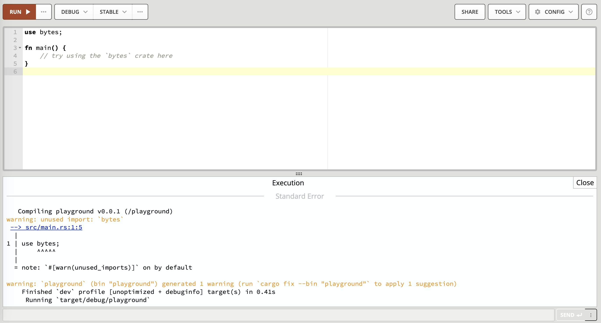

# 工欲善其事必先利其器 —— Rust开发环境之搭建

> 子曰：工欲善其事，必先利其器。居是邦也，事其大夫之贤者，友其士之仁者。


本章是《探幽Rust语言》系列文章的开篇之文，主要包括Rust语言简介、环境安装及相关配置的内容。重点是搭建开发环境，开发环境是修练Rust大法的练兵场和屠龙宝刀。

## Rust简介

Rust语言最初由 Graydon Hoare 在 Mozilla Research 开发，自 2006 年起得到 Mozilla 的支持。Rust第一个有版本号的Rust编译器是2012年1月发布的，2015年5月15日发布了第一个稳定版本1.0版。其设计目标是成为C++的替代品，旨在解决C/C++语言安全性和并发性的问题。与`Golang`一样，被称为是`21世纪的C语言`，不过究竟谁才是 `C语言` 真正的替代者，我们只能拭目以待 ^-^ ！


### Rust特点

能想到的用于描述Rust特点的关键字，大致有`静态强类型`、`极其强大的编译器`、`零成本抽象`、`无垃圾回收器（GC）`、`零运行时（或者说运行时很小）`等等，其中的具体意思后续的文章中会有专门的介绍。Rust同时支持`包括函数式、过程式、面向对象`在内的多种编程范式。总之，它一种相当优秀的现代编程语言。

让我们来看看Rust官方的介绍（https://www.rust-lang.org/zh-CN/）。


其主要的特点有：
1. **高性能**：Rust 速度惊人且内存利用率极高。由于没有运行时和垃圾回收，它能够胜任对性能要求特别高的服务，可以在嵌入式设备上运行，还能轻松和其他语言集成。。
2. **可靠性**：Rust 丰富的类型系统和所有权模型保证了内存安全和线程安全，让您在编译期就能够消除各种各样的错误。
3. **生产力**：Rust 拥有出色的文档、友好的编译器和清晰的错误提示信息， 还集成了一流的工具 —— 包管理器和构建工具， 智能地自动补全和类型检验的多编辑器支持， 以及自动格式化代码等等。


### Rust的使用场景

1. **传统命令行程序**： Rust 编译器可以直接生成目标可执行程序，不需要任何解释程序。
2. **Web应用**：Rust 可以被编译成 WebAssembly，WebAssembly 是一种 JavaScript 的高效替代品。
3. **网络服务器**：Rust 用极低的资源消耗做到安全高效，且具备很强的大规模并发处理能力，十分适合开发普通或极端的服务器程序。
4. **嵌入式开发**：Rust 同时具有JavaScript 一般的高效开发语法和 C 语言的执行效率，支持底层平台的开发。
5. **系统编程**：如操作系统、文件系统、游戏引擎和浏览器的组件。
6. **跨平台应用**：能够编写一次代码，运行在多种操作系统和平台上。

## 安装Rust开发环境
**本文仅介绍`类unix操作系统`的安装，`Windows等其他操作系统`参照相关文档。**
具体的安装过程参考官方的文档：https://www.rust-lang.org/zh-CN/tools/install

### Rust中的版本
Rust有三类版本：稳定版(stable)、公测版(beta)和nightly版，分别对应的是stable分支、beta分支和master分支。

1. 稳定版（stable）：对于大多数Rust开发者而言，最新的稳定版(stable)是最好和最明智的选择；
2. 公测版（Beta）：如果想提前尝鲜下一个稳定版新特性的开发人员，可以使用beta版本；
3. 夜间版（Nightly）：如果想临时尝鲜最新不稳定功能特性的开发人员，可以使用Nightly版本。

### 使用rustup安装最新stable版本
Rust提供了统一的安装、管理、升级、卸载工具 —— `rustup`。其安装命令：
```shell
curl --proto '=https' --tlsv1.2 -sSf https://sh.rustup.rs | sh
```
执行上面的命令，需要先安装好`curl`，它会从`https://sh.rustup.rs`下载`rustup-init.sh`脚本文件，并在命令终端中执行里面的命令。如果一切顺利，最后会终端上打印出类似如下的信息：
```shell
Rust is installed now. Great!

To get started you may need to restart your current shell.
This would reload your PATH environment variable to include
Cargo's bin directory ($HOME/.cargo/bin).

To configure your current shell, you need to source
the corresponding env file under $HOME/.cargo.

This is usually done by running one of the following (note the leading DOT):
. "$HOME/.cargo/env"            # For sh/bash/zsh/ash/dash/pdksh
source "$HOME/.cargo/env.fish"  # For fish
```

参照上面的提示，根据系统的shell类型，配置shell的环境变量。比如：
```shell
$. "$HOME/.cargo/env"
```
执行完上面的命令后，查看一下安装的rustup版本：
```shell
$ rustup --version
rustup 1.27.0 (bbb9276d2 2024-03-08)
info: This is the version for the rustup toolchain manager, not the rustc compiler.
info: The currently active `rustc` version is `rustc 1.78.0 (9b00956e5 2024-04-29)`

```
恭喜你！至此，我们已经把rust最新的stable（即1.78.0）版本安装好了。

还可以执行下面命令，查看rust究竟安装在哪个目录下。
```shell
$ which rustup
/Users/someone/.cargo/bin/rustup
```
### 安装与使用指定版本
1. 安装
```shell
$ rustup install 1.76.0
```
2. 使用
```shell
$ rustc +1.76.0 -V
rustc 1.76.0 (07dca489a 2024-02-04)
$ cargo +1.76.0 --version
cargo 1.76.0 (c84b36747 2024-01-18)
$ cargo +1.66.0 --version
error: toolchain '1.66.0-x86_64-apple-darwin' is not installed
```    
### 查看已经安装的rust工具链
```$ shell
$ rustup show

Default host: x86_64-apple-darwin
rustup home:  /Users/someone/.rustup

installed toolchains
--------------------

stable-x86_64-apple-darwin (default)
nightly-2021-03-11-x86_64-apple-darwin
nightly-2021-10-21-x86_64-apple-darwin
nightly-2022-03-14-x86_64-apple-darwin
nightly-2022-07-11-x86_64-apple-darwin
nightly-2023-04-25-x86_64-apple-darwin
nightly-2024-02-04-x86_64-apple-darwin
nightly-x86_64-apple-darwin
1.76.0-x86_64-apple-darwin
solana

```

### 安装后的几个相关目录解析
有两个目录需要关注，一个是 `$HOME/.cargo`(安装成功后该目录下的bin目录，被加入到了PATH环境变量中)，另一个是`$HOME/.rustup`。

1. `$HOME/.cargo`目录：

```shell
tree -F -L 2 .cargo
.cargo
├── bin/
│   ├── anchor*
│   ├── avm*
│   ├── bindgen*
│   ├── cargo*
│   ├── cargo-add*
│   ├── cargo-clippy*
│   ├── cargo-contract*
│   ├── cargo-dylint*
│   ├── cargo-fmt*
│   ├── cargo-miri*
│   ├── cargo-remote*
│   ├── cargo-rm*
│   ├── cargo-set-version*
│   ├── cargo-upgrade*
│   ├── clippy-driver*
│   ├── dylint-link*
│   ├── grcov*
│   ├── kickstart*
│   ├── mdbook*
│   ├── mini-redis-cli*
│   ├── mini-redis-server*
│   ├── rls*
│   ├── rust-analyzer*
│   ├── rust-gdb*
│   ├── rust-gdbgui*
│   ├── rust-lldb*
│   ├── rustc*
│   ├── rustdoc*
│   ├── rustfmt*
│   └── rustup*
├── config
├── credentials
├── env
├── git/
│   ├── CACHEDIR.TAG
│   ├── checkouts/
│   └── db/
└── registry/
    ├── CACHEDIR.TAG
    ├── cache/
    ├── index/
    └── src/
```

**bin目录下存放了rust开发中常用的cli，比如cargo、rustc、rustdoc、rustup等。**

2. `$HOME/.rustup`目录

```shell
tree -F -L 2 .rustup
.rustup
├── downloads/
├── settings.toml
├── tmp/
├── toolchains/
│   ├── 1.76.0-x86_64-apple-darwin/
│   ├── nightly-2021-03-11-x86_64-apple-darwin/
│   ├── nightly-2021-10-21-x86_64-apple-darwin/
│   ├── nightly-2022-03-14-x86_64-apple-darwin/
│   ├── nightly-2022-07-11-x86_64-apple-darwin/
│   ├── nightly-2023-04-25-x86_64-apple-darwin/
│   ├── nightly-2024-02-04-x86_64-apple-darwin/
│   ├── nightly-x86_64-apple-darwin/
│   ├── solana -> /Users/someone/solana-release/bin/sdk/sbf/dependencies/platform-tools/rust
│   └── stable-x86_64-apple-darwin/
└── update-hashes/
    ├── 1.76.0-x86_64-apple-darwin
    ├── nightly-2021-03-11-x86_64-apple-darwin
    ├── nightly-2021-10-21-x86_64-apple-darwin
    ├── nightly-2022-03-14-x86_64-apple-darwin
    ├── nightly-2022-07-11-x86_64-apple-darwin
    ├── nightly-2023-04-25-x86_64-apple-darwin
    ├── nightly-2024-02-04-x86_64-apple-darwin
    ├── nightly-x86_64-apple-darwin
    └── stable-x86_64-apple-darwin
```

**`setting.toml`是rust的配置文件**，其内容如下：

```shell
$ cat .rustup/settings.toml
default_host_triple = "x86_64-apple-darwin"
default_toolchain = "stable-x86_64-apple-darwin"
profile = "default"
version = "12"

[overrides]
"/Users/someone/Desktop/Demo" = "nightly-x86_64-apple-darwin"
"/Users/someone/deeper-chain" = "nightly-2021-10-21-x86_64-apple-darwin"
```
* 上面的`default_toolchain`，指示了当前默认使用的工具链版本`stable-x86_64-apple-darwin`，即目标机器为apple，处理器架构为x86，rust的版本为stable 。
* 上面的`[overrides]`，是对具体的项目的版本进行定制化重写。比如对位于`/Users/someone/Desktop/Demo`的项目而言，其目标机器为apple，处理器架构为x86，rust的版本为nightly 。

**`toolchains`目录，它下面存放了安装到本地的所有版本的toolchain 。**

### 几个常用命令
与搭建开发环境相关的几个常用命令，作为总结列出如下：

* 更新

```shell
rustup update
rustup update stable #stable可替换为你想要的版本
```
* 安装指定版本

```shell
rustup install seme_ver
```

* 卸载

```shell
rustup self uninstall
```
* 版本间切换

```shell
rustup default stable 
rustup default nightly
rustup default beta #如果没有安装，切换的时候为安装
```

## 使用特定版本构建项目

### 使用 `rustup override`
构建项目时所用的版本，是由`.rustup/settings.toml`中的`default_toolchain`指定的，通常情况下都是最新的stable版本。对于要使用特定版本进行构建的rust项目，我们可以通过`rustup  override`来指定版本号。下面是一个例子：
```shell
$ cargo new hello #用cargo创建一个项目，项目名称为hello
$ rustc -V #查看rustc的版本，当前最新的版本为 1.78.0
rustc 1.78.0 (9b00956e5 2024-04-29)

$ cd hello
$ rustup override set 1.76.0 #指定当前项目的rust版本为1.76.0
info: override toolchain for '/Users/someone/Desktop/rust_study/hello' set to '1.76.0-x86_64-apple-darwin'

```

我们用cargo创建了一个新的hello项目，并该项目下，指定其使用1.76.0版本进行构建。
现在，在该项目下执行rustc查看版本：
```shell
$ rustc -V
rustc 1.76.0 (07dca489a 2024-02-04)
```

再跳到项目之外的目录，再次查看rustc版本：
```shell
$ cd ~
$ rustc -V
rustc 1.78.0 (9b00956e5 2024-04-29)
```
rustc override的原理其实是在 `$HOME/.rustup/settings.toml`文件中添加了一些内容：
```shell
cat .rustup/settings.toml
default_host_triple = "x86_64-apple-darwin"
default_toolchain = "stable-x86_64-apple-darwin"
profile = "default"
version = "12"

[overrides]
"/Users/someone/Desktop/Demo" = "nightly-x86_64-apple-darwin"
"/Users/someone/Desktop/rust_study/hello" = "1.76.0-x86_64-apple-darwin"
"/Users/someone/deeper-chain" = "nightly-2021-10-21-x86_64-apple-darwin"
```
如上所示，在[overrides]的第二行，新增了一条规则，指定hello项目的构建工具链版本为特定版本。
可以使用`rustup override unset`取消重载效果：
```shell
$ rustup override unset
```

### 使用`rust-toolchain.toml` 文件
使用上面的`rustup override set`命令指定工具链的版本，致使项目的配置信息与`.rustup/settings.toml`紧耦合在一起，不利于通过git进行协同合作。Rust提供了另一种方法，即在项目根目录下放置一个名为`rust-toolchain.toml`配置文件，其大致内容如下：
```toml
[toolchain]
channel = "1.76.0"
```

取消掉之前的设置：
```shell
$ rustup override unset # 在项目的目录下执行
```

然后`rust-toolchain.toml`就生效了：
```shell
$ rustc -V #在hello项目的目录下执行
rustc 1.76.0 (07dca489a 2024-02-04)
```
可见，工具链的override存在着优先级，Rust规定版本override的优先级顺序由高到低依次是：
1. plus语法：`rustc +1.76.0 -V`
2. `RUSTUP_TOOLCHAIN` 环境变量 (default: none)
3. `rustup override set` 命令
4. `rust-toolchain.toml`
5. `默认toolchain`


## 加速cargo
cargo是Rust的重要工具，其中的作用之一就是包管理（类似于Golang中的go mod，Java中的Maven），在开发rust程序时，默认会从crates.io仓库中下载程序所依赖的包（crate)。由于众所周知的原因，速度可能会很慢。业界一种通常做法，是把cargo源配置为国内的镜像。以下是在类unix系统中的配置方法。
1. 进入`$HOME/.cargo`目录
```shell
$ cd $HOME/.cargo
```
2. 创建`config`
```shell
$ touch config #如果没有该文件
```
3. 把如下所示的内容复制到`config`中
```shell
[source.crates-io]
registry = "https://github.com/rust-lang/crates.io-index"

replace-with = 'ustc' #根据需要替换你想要的镜像，比如：tuna、rustcc 等

# 中国科学技术大学
[source.ustc]
registry = "https://mirrors.ustc.edu.cn/crates.io-index"

# 上海交通大学
[source.sjtu]
registry = "https://mirrors.sjtug.sjtu.edu.cn/git/crates.io-index/"

# 清华大学
[source.tuna]
registry = "https://mirrors.tuna.tsinghua.edu.cn/git/crates.io-index.git"

# 阿里云rustcc社区
[source.rustcc]
registry = "https://code.aliyun.com/rustcc/crates.io-index.git"

# 字节跳动
[source.rsproxy]
registry = "https://rsproxy.cn/crates.io-index.git"
``` 

## Rust在线练兵场
如果你不想在本地安装开发环境，Rust官方提供了一个在线练兵场以供你学习或体验。这个练兵场就是：[Rust Playground](https://play.rust-lang.org/?version=stable&mode=debug&edition=2021)



在这个Playground中，你可以选择Rust的版本（stable、beta、nightly）、编译模式（debug、release）、Rust的版本；可以选择执行一些工具，比如rustfmt；可以选择执行的命令：Run、Build、Test、MIR等。


## 编辑器与IDE
这一块没有具体的要求，可选择的范围也比较多。当前大致可选择的有：`Vscode`、`Sublime Text`、`Rustrover`、`Eclipse`、`Clion`、`Vim`等。


具体选择哪一款，看自己的喜好。相关的配置，可自行参照对应产品的文档。
官方提供的链接：[用于开发Rust的IDE](https://www.rust-lang.org/zh-CN/tools)

## 总结
本文分别就`Rust简介、Rust开发环境的搭建、使用特定版本构建项目、加速cargo的配置`等内容进行了系统的介绍，阅读完并按照本文的步骤操作下来，应能在本地成功地搭建好Rust开发环境。

至此，我们有了修练Rust大法屠龙宝刀。只是，这把刀尚徒有其名。通往Rust殿堂的路，已在脚下。等待你的，有如狐如妖的诱惑，有`剪不断理还乱`的情愁，也有`本来无一物,何处惹尘埃`的通透与惬意。既然选择了，就不要轻言放弃。千磨万击还坚韧,任尔东南西北风。出发吧，少年！

## 参考文档
Rust官网：https://www.rust-lang.org/zh-CN/
Gopher的Rust第一课：https://mp.weixin.qq.com/s/hiINDJOZNZwIzIFjr4Myhg
